# Orange / White Theme Update — 2026-04-22

**What this is:** the first post-release visual update to the site. You asked to move from the bronze/gold editorial accent to an orange/white palette. This document summarises what changed, shows before/after, and explains what's easy to tweak next.

## TL;DR

The accent colour changed from bronze `#A16207` to a three-tier terracotta family:

- **Terracotta** `#B8431E` — main headings, prices, icons, badges, hovers
- **Warm sienna** `#E07A3C` — italic sub-words in large headings, hero gradient, footer brand
- **Peach cream** `#FBEBDD` — background wash on the Home page's CTA section

Nothing else changed — same layout, same typography, same photography, same motion. Only colour.

We took a deliberate restraint decision: **product names stay dark**, even though all other headings went terracotta. Reason: if the product photos and product-name H3s both fight for attention, the product photos lose. Keeping product titles ink-black lets the photography stay the visual star. You can see this clearly on the Product Detail page below.

## Before / After

All screenshots at 1440×900. The "before" screenshots were captured from the pre-retheme commit (`1444ac6`) running in parallel so the comparison is honest.

### Home — Hero

The italic phrase "to Last" changed from a bright gold to a warm sienna that reads as "same hue family, different brightness." Also a near-invisible warm terracotta whisper was added to the middle of the dark overlay gradient — it's not a band you notice, but it softens the hero against the furniture photography.

| Before | After |
|---|---|
| 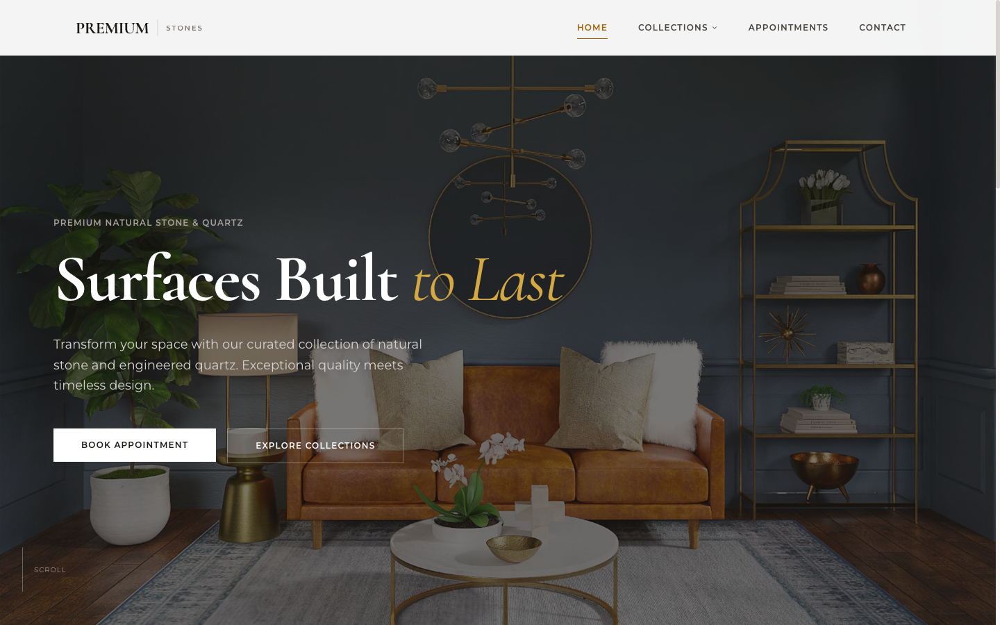 | 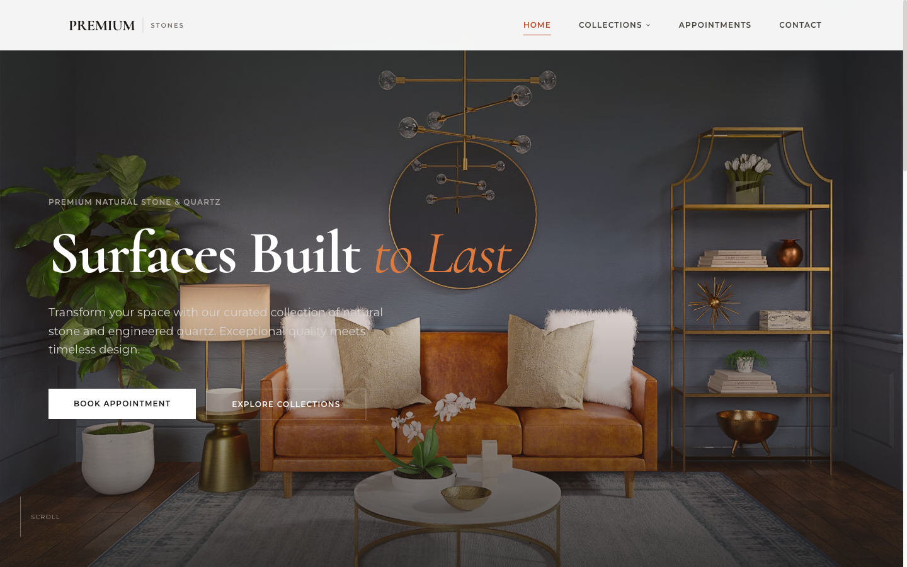 |

### Home — "Ready to Transform Your Space?" CTA section

The biggest single visible change on the site. The CTA section now sits on a peach-cream wash so it reads as a destination, not more scroll. The H2 main text goes terracotta, the italic "Your Space?" goes warm sienna, and the "Contact Information" card heading goes terracotta to match.

| Before | After |
|---|---|
| 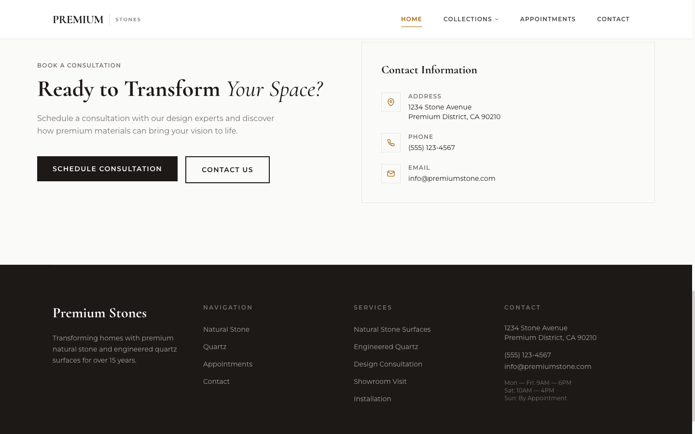 | 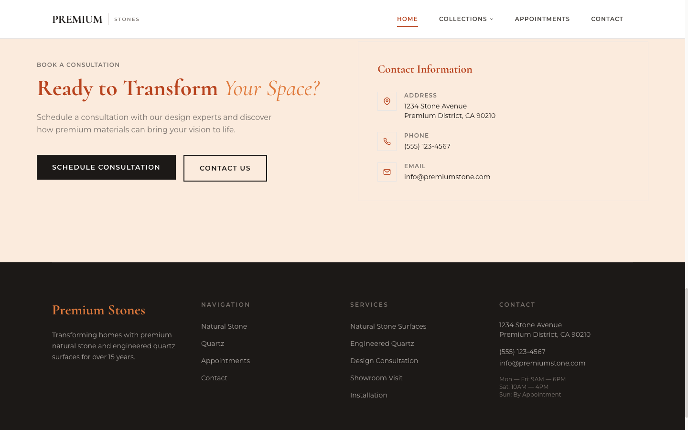 |

### Home — Footer

The "Premium Stones" brand heading at the bottom of every page now glows in warm sienna against the dark footer background. This creates a deliberate top-of-page / bottom-of-page echo with the hero italic.

| Before | After |
|---|---|
| 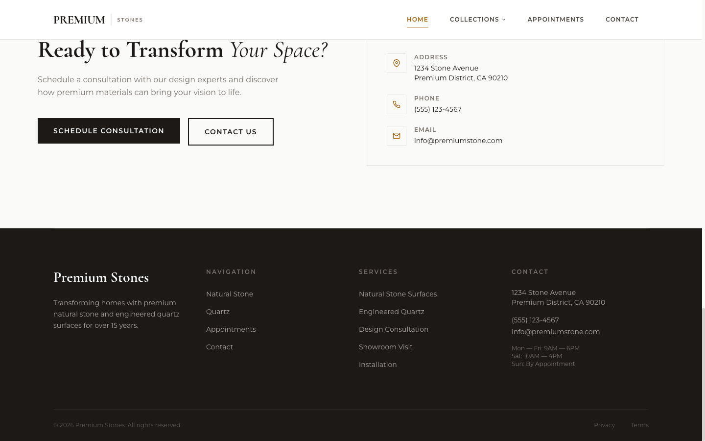 | 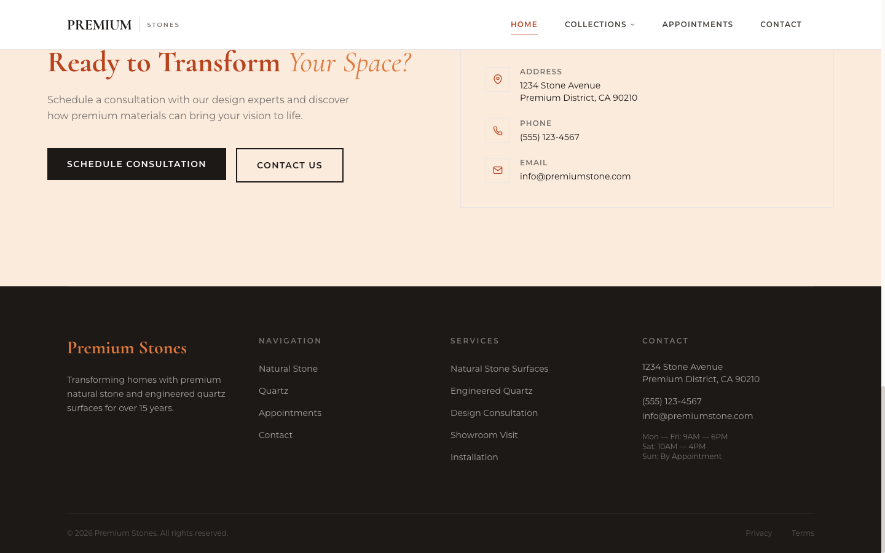 |

### Natural Stone — listing hero

Category page headings now use a two-tone terracotta + warm-sienna split. Same pattern on every listing page.

| Before | After |
|---|---|
| 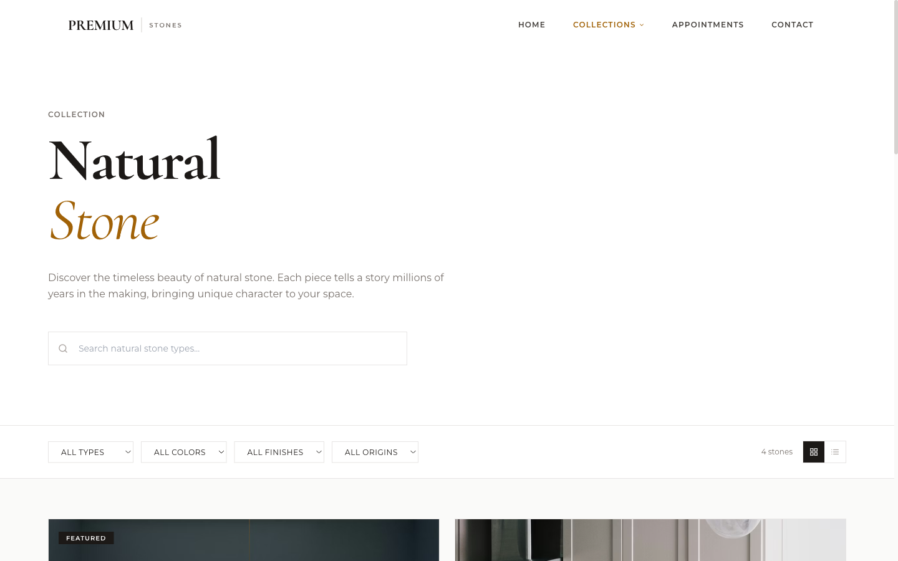 | 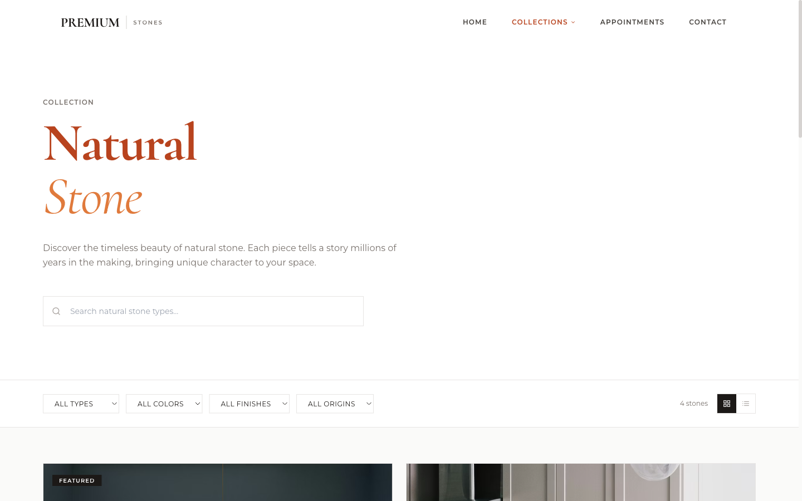 |

### Quartz — listing hero

Identical treatment as Natural Stone. Same two-tone H1.

| Before | After |
|---|---|
| 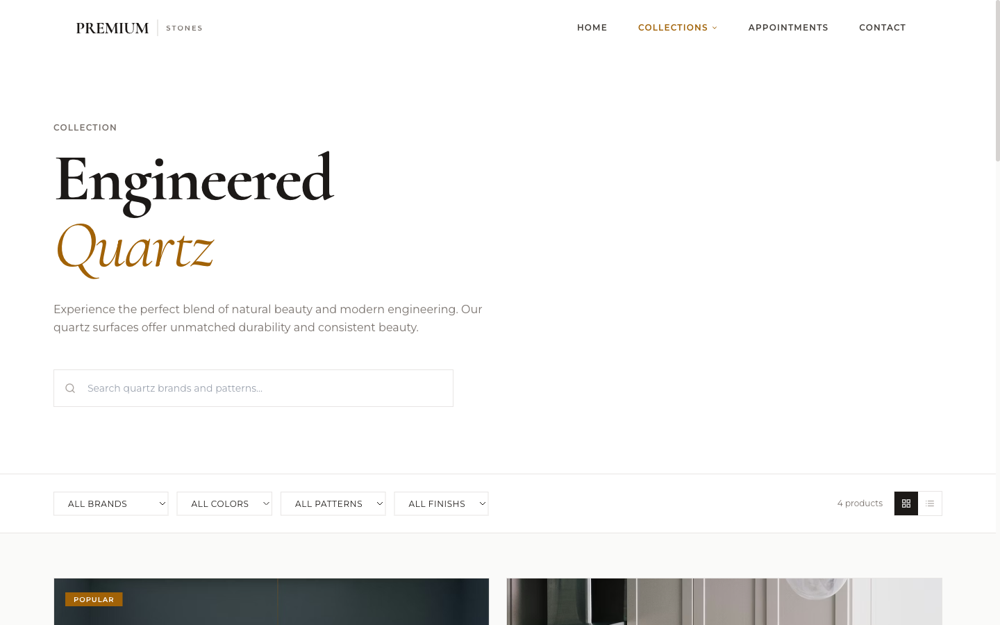 | 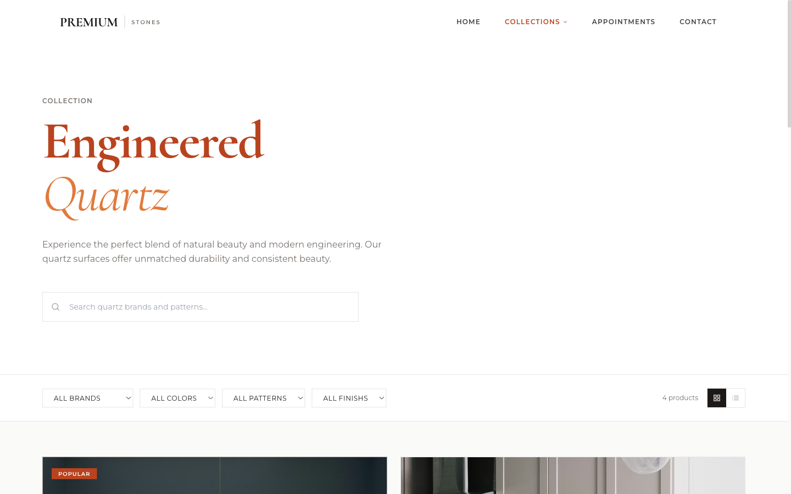 |

### Product Detail — "Carrara Marble Classic"

**Important restraint decision visible here.** The product name "Carrara Marble Classic" stays ink-black. The price `$89/sq ft` below it is now terracotta. Result: price pops, product name stays dignified, photography stays the star. If we made both orange, the page would feel flat and shouty.

| Before | After |
|---|---|
| 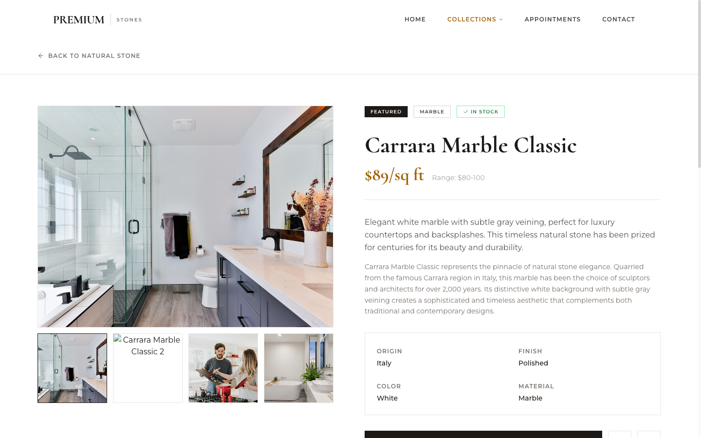 |  |

### Appointments — Book Your Appointment

Two-tone H1 plus all the sidebar card headings ("Visit Our Showroom", "What to Expect", "Schedule Your Visit") now terracotta.

| Before | After |
|---|---|
| 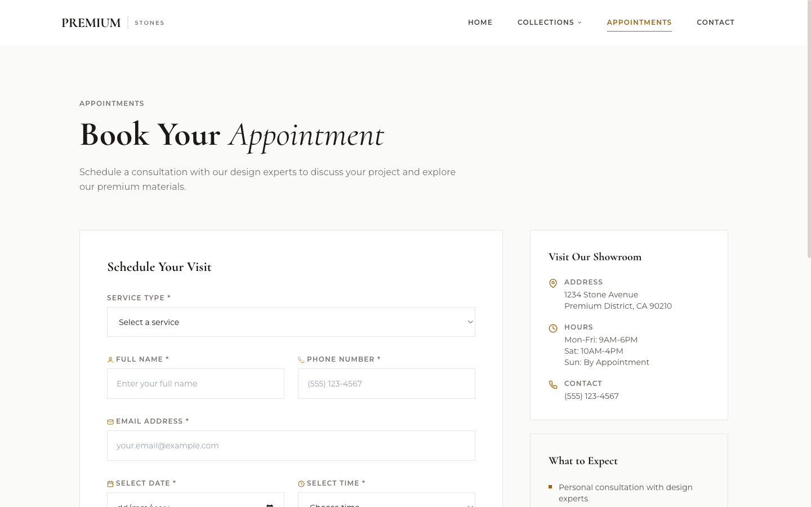 | 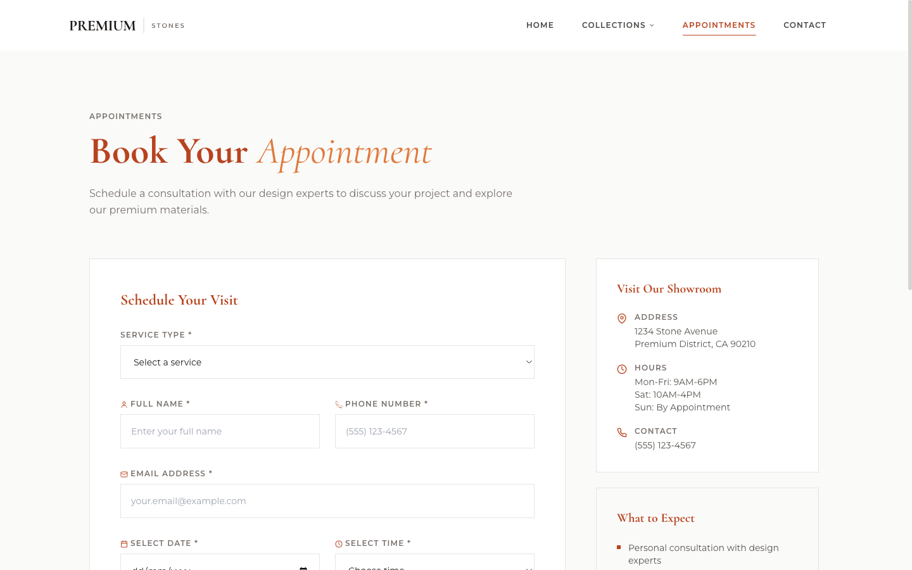 |

### Contact — Let's Start Your Project

Same two-tone pattern on the H2. "Send Us a Message" form heading also terracotta.

| Before | After |
|---|---|
| 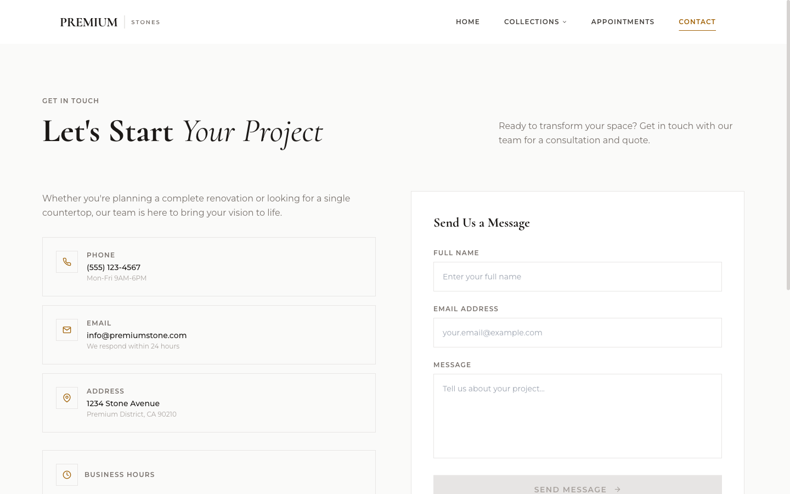 | 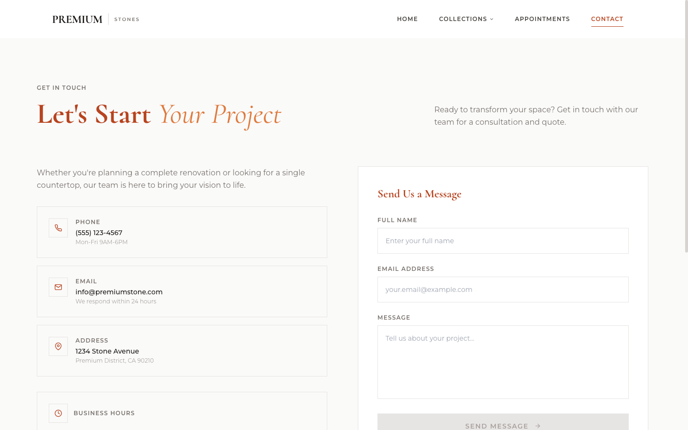 |

## What changed (bullet list)

1. Hero italic word "to Last" → warm sienna (was gold).
2. All page H1 main words on white → terracotta (was ink black).
3. All H1 italic sub-words → warm sienna (was inconsistent — sometimes bronze, sometimes ink).
4. All section H2s → terracotta (was ink black).
5. Structural H3s — "Visit Our Showroom", "What to Expect", "Contact Information", "Send Us a Message", "Applications", "Technical Specifications", "Care & Maintenance" — → terracotta.
6. Home CTA section background → peach-cream wash (was off-white, blended with the section above it).
7. Hero gradient → added a faint warm mid-band (was plain dark).
8. Footer "Premium Stones" → warm sienna (was white).
9. Prices, nav active underline, icons, bullets, badges, button hovers, text selection highlight — all picked up the new terracotta automatically via the Tailwind token.

## What stayed the same (on purpose)

- Layout, spacing, photography, typography scale.
- Body text stays dark (`#1C1917`). Orange body text would be a disaster.
- Primary buttons stay dark with white text; they only shift to terracotta on hover. Orange-filled buttons look cheap; dark + orange-hover is the Hermès/editorial formula.
- Logo "PREMIUM | STONES" in the navigation — a brand mark, not a theme element.
- Product names on every product card and on the detail page stay ink-black — the **deliberate** carve-out described above.
- Secondary stone-grey labels (eyebrows, filter labels, card metadata) stay neutral — they're functional chrome, not headings.
- Framer Motion animations unchanged — identical reveal timing and direction.
- "IN STOCK" green badge unchanged — that's a semantic colour, separate system.

## What we considered but rejected

| Option | Why we said no |
|---|---|
| Paint the primary buttons orange (solid terracotta instead of dark) | Orange-filled buttons on white read as "fast food / discount hardware store." Dark + terracotta-hover stays luxury. |
| Warm the base page background (off-white → peach-tinted everywhere) | The terracotta accents need cool neutrals to pop against. Warming the field dulls the accent. |
| Bright pure orange (like a tech brand) instead of terracotta | Terracotta matches natural-stone imagery (warm earth tones). Bright orange competes with the product photos. |
| Paint the logo | That would be a rebrand, not a theme update. The logo is brand equity and should only change when you deliberately decide to evolve the mark. |
| Tint the focus outlines and scrollbar | Accessibility — functional chrome should stay neutral so keyboard/assistive users can see it clearly. |
| Make the CTA wash more saturated than `#FBEBDD` | Anything stronger pushes the section into "warning / attention" territory rather than "inviting destination." |

## How to request further changes

If you want to adjust anything:

- **Make the orange browner / redder / brighter:** edit one hex value in `tailwind.config.js` (the `accent.DEFAULT` token). Takes 5 minutes to apply + verify. Recipe in `docs/HOW-TO-REVISE.md`.
- **Move a specific heading back to ink-black:** also straightforward. Recipe in the revision playbook.
- **Add the peach-cream wash to a different section:** one-line change. Recipe in the revision playbook.
- **Replace the orange entirely with a different colour family:** a bit more work, but the architecture is designed to make this a single-file change — the spec and plan from this round show how. Estimate 1-2 hours to design + apply + verify.

All revision rounds follow the same workflow: we write a short spec, a task-by-task plan, execute, run visual regression to confirm nothing unintended broke, then update this changelog with a new entry.

## Related documents

- **Design spec** (engineering rationale, contrast budget, risks): `docs/superpowers/specs/2026-04-22-orange-white-theme-design.md`
- **Implementation plan** (what was edited, step by step): `docs/superpowers/plans/2026-04-22-orange-white-theme.md`
- **Revision playbook** (how to request common tweaks): `docs/HOW-TO-REVISE.md`
- **Project progress index** (high-level state of the site): `PROGRESS.md`
